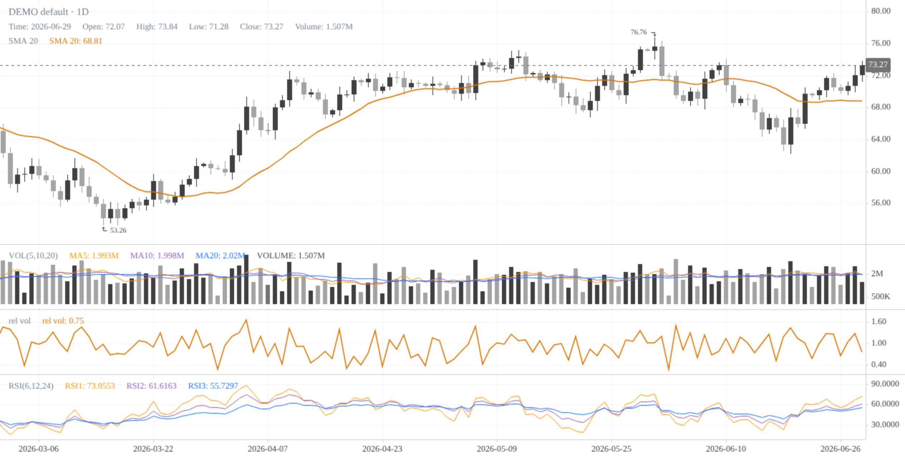
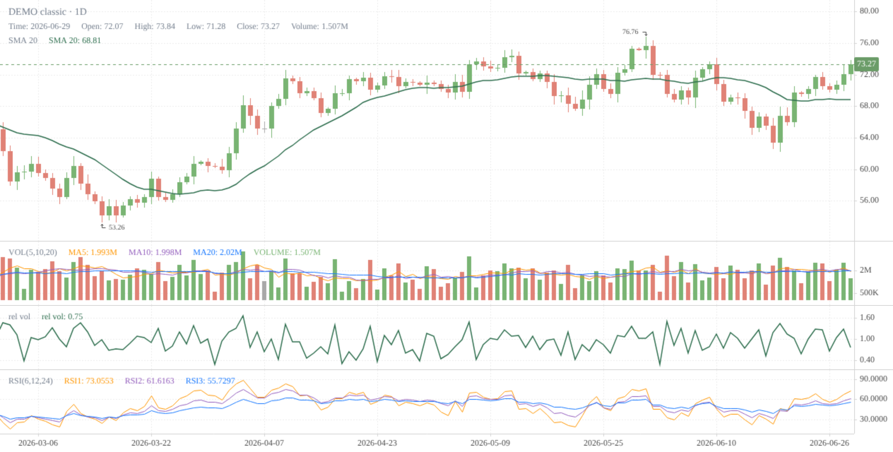
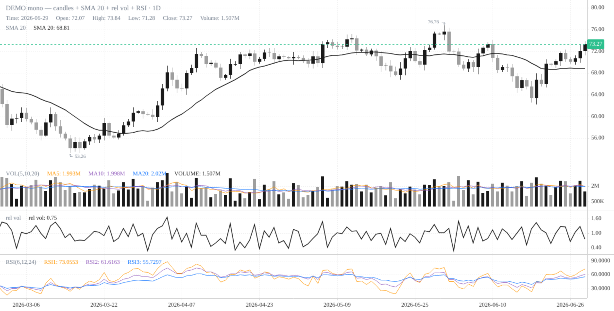
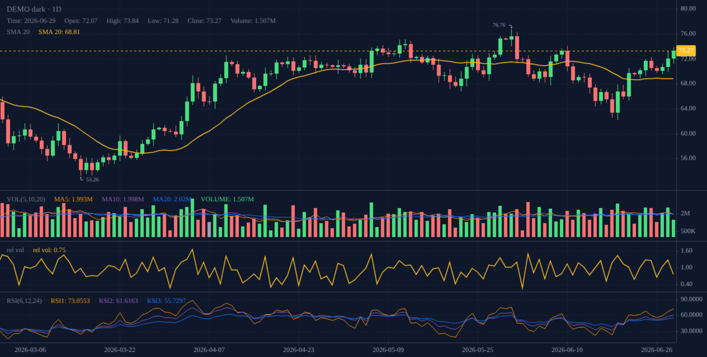
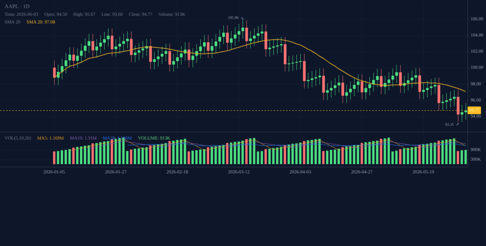
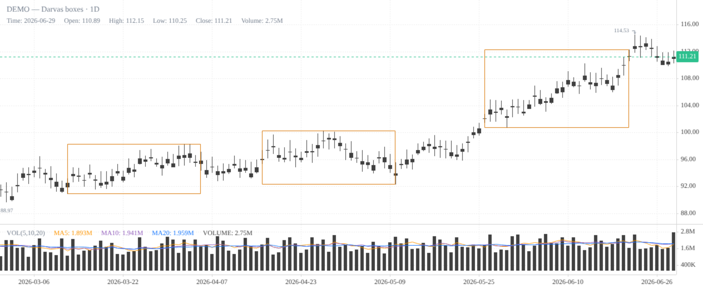

# klinepy

Python wrapper for KLineCharts (klinecharts@10) — one chart spec, three outputs:
standalone HTML, embeddable fragment, marimo/anywidget widget.

Three built-in themes — grayscale + amber (default), pastel green/red, black/grey —
plus fully custom colors:

| `theme="default"` | `theme="classic"` | `theme="mono"` |
|---|---|---|
|  |  |  |

```python
KLineChart(bars, theme="classic")   # preset; explicit *_color kwargs still override
```

Custom palettes via a dict (merges into the theme) or the `Colors` dataclass
(replaces it) — both accept the same keys: `up`, `down`, `no_change`, `accent`,
`price_line` (dashed last-price line + tag), `background`, `grid`, `border`, `text`.

```python
from klinepy import KLineChart, Colors

# tweak one key of a preset
KLineChart(bars, theme="classic", colors={"accent": "#b91c1c"})

# full custom, e.g. dark
KLineChart(bars, colors=Colors(
    up="#4ade80", down="#f87171", accent="#fbbf24", price_line="#fbbf24",
    background="#0f172a", grid="#1e293b", border="#334155", text="#94a3b8",
))
```



### 🎬 Animated tour



*Dark-mode tour — candles + SMA, Darvas boxes, a `static-charts-v1` bundle
(rs line + blue dots), and RRG mode. Video: [docs/tour/tour.webm](docs/tour/tour.webm)
(attach it to the release/PR for inline playback);
regenerate with `uv run python scripts/emit-tour-html.py && node scripts/capture-tour.mjs`
(requires `npx playwright install chromium` + ffmpeg).*

Precedence: `*_color` kwargs > `colors` > `theme` > defaults.

Grayscale theme with a single amber accent (`#d97706`). The JS side loads the
klinecharts ESM build from jsDelivr (needs internet in the browser); the
Python side is pure data (polars/pandas frames or dicts — no data deps).

## Usage

```python
from klinepy import KLineChart, html, fragment

chart = KLineChart(
    bars,                      # polars/pandas DataFrame or list of dicts
    lines={"SMA 20": sma},     # overlay lines on the price pane, aligned/padded to bar count
    panes={"rel vol": rv},     # own-pane series (one sub-pane per named series)
    overlays=[boxes],          # boxes / klinecharts overlay specs, see below
    title="AAPL",
    indicators=[{"name": "MACD"}}],  # optional built-in klinecharts indicators
    height=460,
)

# 1. marimo / Jupyter widget
mo.ui.anywidget(chart)

# 2. standalone HTML document (CDN ESM, no build step)
open("aapl.html", "w").write(chart.to_html())   # or: html(chart)

# 3. embeddable fragment for web apps (no <html> wrapper)
page += chart.fragment()                        # or: fragment(chart)
```

### Overlays

`lines` and `panes` plot the values you pass (amber accent). For boxes — e.g.
Darvas:

```python
chart = KLineChart(bars, overlays=[
    {"start": dt.date(2026, 1, 5), "end": dt.date(2026, 1, 25),
     "top": 103.0, "bottom": 97.0},          # rendered as an amber rect
])
```



Full [klinecharts overlay specs](https://klinecharts.com/en-US/guide/overlay)
(`priceLine`, `segment`, `simpleTag`, …) pass through unchanged:

```python
overlays=[{"name": "priceLine", "points": [{"timestamp": ts_ms, "value": 99.5}]}]
```

## Static chart bundles (`static-charts-v1`)

One versioned, self-describing JSON per symbol — the data contract for
standalone HTML / static sites. Charts never fetch or compute data; you
produce the bundle (e.g. 2y OHLCV bars, rs_line, blue_dots, benchmark,
fundamentals), klinepy validates, stamps `schema_version`, and renders.

```python
from klinepy import ChartBundle, emit, html, load_bundle

bundle = ChartBundle(
    symbol="AAPL",
    bars=bars,                          # same inputs as KLineChart
    rs_line=rs,                         # price-pane overlay line
    blue_dots=[{"session": d, "value": 104.0}],   # dot markers at highs
    benchmark="SPY",                    # metadata (not drawn)
    fundamentals={"market_cap": 3.4e12},          # metadata (not drawn)
)
data = emit(bundle, "charts/AAPL.json")           # validated + version-stamped

html("charts/AAPL.json")   # bundle path → standalone HTML
html(data)                 # or the dict; fragment(...) works the same way
load_bundle("charts/AAPL.json")                   # read + validate a bundle
```

`to_chart(bundle)` / `html(bundle)` / `fragment(bundle)` also accept plain
`KLineChart` instances unchanged. Bump `schema_version` keys (`static-charts-v2`)
only for breaking shape changes; loaders reject unknown versions.

## Development

```bash
uv sync
uv run pytest
```
