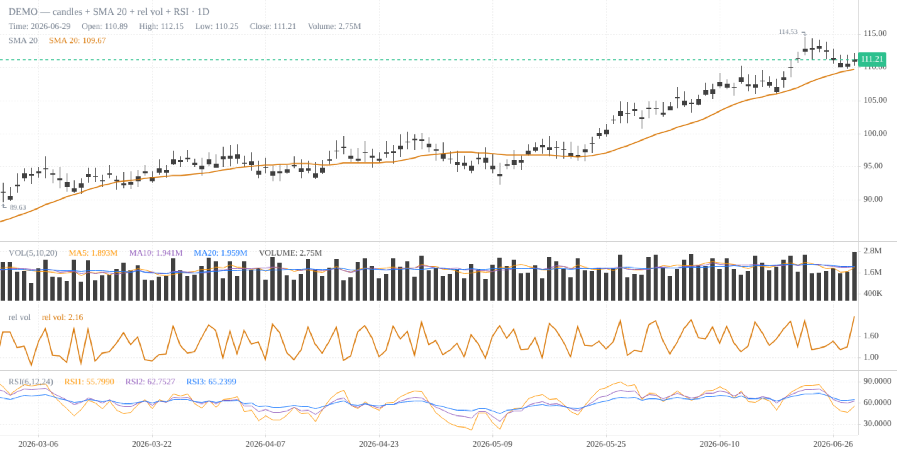

# klinepy

Python wrapper for KLineCharts (klinecharts@10) — one chart spec, three outputs:
standalone HTML, embeddable fragment, marimo/anywidget widget.

Three built-in themes — grayscale + amber (default), pastel green/red, black/grey:

| `theme="default"` | `theme="classic"` | `theme="mono"` |
|---|---|---|
|  |  |  |

```python
KLineChart(bars, theme="classic")   # or "mono"; explicit *_color kwargs still override
```

Grayscale theme with a single amber accent (`#d97706`). The JS side loads the
klinecharts ESM build from jsDelivr (needs internet in the browser); the
Python side is pure data (polars/pandas frames or dicts — no data deps).

## Usage

```python
from klinepy import KLineChart, html, fragment

chart = KLineChart(
    bars,                      # polars/pandas DataFrame or list of dicts
    lines={"SMA 20": sma},     # overlay lines on the price pane, aligned/padded to bar count
    panes={"rel vol": rv},     # own-pane series (one sub-pane per named series)
    overlays=[boxes],          # boxes / klinecharts overlay specs, see below
    title="AAPL",
    indicators=[{"name": "MACD"}}],  # optional built-in klinecharts indicators
    height=460,
)

# 1. marimo / Jupyter widget
mo.ui.anywidget(chart)

# 2. standalone HTML document (CDN ESM, no build step)
open("aapl.html", "w").write(chart.to_html())   # or: html(chart)

# 3. embeddable fragment for web apps (no <html> wrapper)
page += chart.fragment()                        # or: fragment(chart)
```

### Overlays

`lines` and `panes` plot the values you pass (amber accent). For boxes — e.g.
Darvas:

```python
chart = KLineChart(bars, overlays=[
    {"start": dt.date(2026, 1, 5), "end": dt.date(2026, 1, 25),
     "top": 103.0, "bottom": 97.0},          # rendered as an amber rect
])
```


Full [klinecharts overlay specs](https://klinecharts.com/en-US/guide/overlay)
(`priceLine`, `segment`, `simpleTag`, …) pass through unchanged:

```python
overlays=[{"name": "priceLine", "points": [{"timestamp": ts_ms, "value": 99.5}]}]
```

## Development

```bash
uv sync
uv run pytest
```
